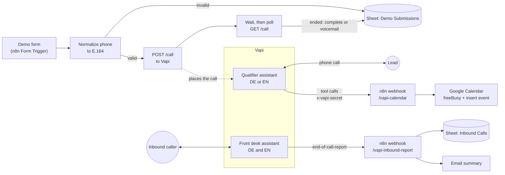
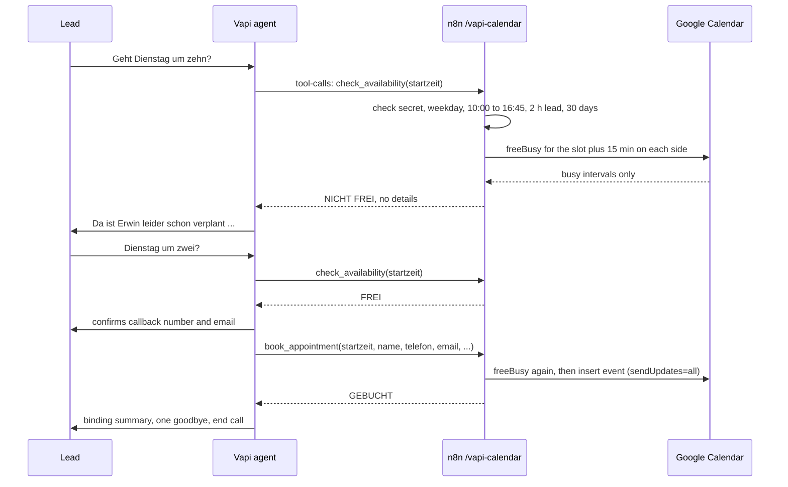

# AI phone agent (Vapi + n8n)

Voice agents that call a new web lead back within seconds, qualify them in natural German or English, book a
slot in the owner's calendar while still on the phone, and answer the owner's phone when they cannot.
Vapi runs the voice side, n8n runs the business logic.

This is a sanitized version of the phone agent system I built for my agency, YCAT (You Can Automate This).
The prompts, tool definitions and n8n workflows are exported from that setup. Ids, credentials and private
values are replaced by placeholders, and all sample data is fictional. For this public version the front desk
prompt and its report were trimmed to a general receptionist.

## The problem

A small business pays for ads, the ads produce web inquiries, and the inquiries wait hours or days for a
callback. By then the lead has called someone else. An agent that calls back right away, asks the right
questions and books the appointment closes that gap. This version targets German small businesses: the
agents speak natural German (the qualifier also has an English version) and say up front that they are an AI.

## What it does

| Part | What it does |
|---|---|
| Outbound qualifier, German and English | Calls the lead seconds after the demo form is sent. Says it is an AI, confirms the request, asks about motivation, timeline, experience with automation and budget, then offers a call with the owner. |
| Calendar tools | `check_availability` and `book_appointment`. The agent calls them mid-conversation. An n8n webhook checks Google Calendar free/busy and books the event, with an invite if the lead gave an email. |
| Front desk (German and English) | Answers inbound calls for the owner and sorts callers into new inquiry, existing customer, partner or supplier, sales or spam call, and other. Takes a message, sets up a callback, never gives out private details. |
| Post-call report | After each front desk call, n8n reads the structured outputs from Vapi's end-of-call report, logs a row in Google Sheets and emails a summary. |
| Outbound workflow | Form trigger, phone normalization to E.164, `POST /call` to Vapi, polling until the call ends, voicemail branch, structured results logged to Google Sheets. |

## Architecture



A booking during the call:



## Quickstart: offline demo

Needs Python 3.10 or newer and nothing else. No account, no API key, no network beyond 127.0.0.1.

```bash
python demo.py        # or: make demo
```

The demo starts the two webhooks locally with a fake calendar and a frozen clock (Monday 5 Oct 2026, 09:00
Berlin), then:

1. turns a demo form submission into the Vapi call request (built, not sent),
2. plays a scripted German call whose tool calls go over HTTP to the local calendar webhook,
3. runs the rule and error branches of that webhook,
4. shows the sheet row and the email that a finished call produces.

Excerpt of the real output:

```text
  Jane    Ja, wieso nicht. Geht Samstag um elf?
  tool >  check_availability {"startzeit": "2026-10-10T11:00:00+02:00"}
  tool <  Am Wochenende ist Erwin nicht erreichbar. Bitte einen Werktag vorschlagen.  [ok]
  Elias   Am Wochenende ist Erwin leider nicht erreichbar. Passt Ihnen ein Werktag?
  Jane    Dann Dienstag um zehn.
  tool >  check_availability {"startzeit": "2026-10-06T10:00:00+02:00"}
  tool <  NICHT FREI: Dienstag, 6. Oktober um 10:00 Uhr ist leider schon verplant. Bitte einen
          anderen Vorschlag erfragen. Keine Details nennen.  [ok]
          (10:00-10:30 itself is empty, but a busy block starts 10:40, inside the 15 minute buffer.
          The caller hears no details.)
  Elias   Da ist Erwin leider schon verplant. Haben Sie noch einen anderen Vorschlag?
  Jane    Dienstag um zwei?
  tool >  check_availability {"startzeit": "2026-10-06T14:00:00+02:00"}
  tool <  FREI: Dienstag, 6. Oktober um 14:00 Uhr ist verfuegbar. Bei Zusage direkt mit
          book_appointment buchen.  [ok]
  ...
  tool >  book_appointment {"startzeit": "2026-10-06T14:00:00+02:00", "dauer_minuten": 30, "name":
          "Jane Example", "firma": "Acme Example GmbH", "telefon": "+49 30 01234567", "email":
          "jane@acme-example.com", "thema": "Formular-Anfragen automatisch zurückrufen"}  (arguments
          sent as a JSON string)
  tool <  GEBUCHT: Dienstag, 6. Oktober um 14:00 Uhr ist fest eingetragen (Termin-ID evt0001). Bitte
          verbindlich zusammenfassen.  [ok]
  ...
3) Rule and error branches of the same webhook
  less than 2 h ahead             Dieser Termin liegt zu kurzfristig oder in der Vergangenheit. Der
                                  frueheste Termin ist in etwa zwei Stunden.  [ok]
  ...
  same slot booked twice          NICHT FREI: Dienstag, 6. Oktober um 14:00 Uhr ist inzwischen
                                  verplant. Bitte einen anderen Vorschlag erfragen.  [ok]
  ...
  wrong x-vapi-secret             HTTP 401: Interner Fehler: nicht autorisiert.  [ok]
  ...
14/14 tool calls answered as expected.
```

The agent lines are scripted. The tool answers are real output of the webhook logic. The answers are German
on purpose: the model reads them, and the prompt tells it how to react to FREI, NICHT FREI, GEBUCHT and rule
messages.

### Tests

```bash
pip install -r requirements-dev.txt
python -m pytest
```

141 tests: parsing and validation, slot rules, the booking decision, phone normalization, the post-call logic,
the HTTP server, both call scripts end to end, the agent configs, the n8n exports, and `sync` against a fake
Vapi API. `tests/test_js_parity.py` pulls the JavaScript code nodes out of `n8n/*.json`, runs them under
Node.js with a frozen clock and checks that the Python port gives identical output. Those tests are skipped
when `node` is not installed.

## Real mode

1. `cp .env.example .env` and fill it in: Vapi private key, a webhook secret, your n8n URL, calendar id,
   sheet id, notification email.
2. `python -m phone_agent plan` renders every Vapi payload into `build/vapi/` and lists what is still missing.
3. `python -m phone_agent sync --dry-run`, then `python -m phone_agent sync`. This creates or updates the two
   tools, 14 structured outputs and three assistants, and stores their ids in `.state/vapi_ids.json`.
   Running it again updates in place.
4. `python -m phone_agent render-n8n` fills the n8n exports with your values and those ids, adds fresh node
   ids and webhook ids, and writes the files to `build/n8n/`.
5. In n8n, import the four files (Workflows > Import from File) and pick credentials on the nodes that need
   them: Google Calendar OAuth2 (`freeBusy`, `Termin eintragen`), Google Sheets OAuth2 (the `Log ...` nodes),
   Gmail OAuth2 (`Notify Erwin`), and an HTTP Bearer credential with the Vapi private key (`Call Lead`,
   `Get Call Details`). Activate the calendar and report workflows.
6. Import or buy a phone number in Vapi, set the front desk assistant for inbound calls, put the number's id
   into `VAPI_PHONE_NUMBER_ID`, render again and activate the outbound workflow.

The sheet needs two tabs with these header rows:

| Tab | Columns |
|---|---|
| Demo Submissions | Date, Name, Phone, Email, Company, Request, Company Size, Service Interest, Motivation, Urgency, Past Experience, Budget, Appointment Interest, Summary, Status, Callback Window |
| Inbound Calls | Date, Caller Number, Caller Name, Company, Category, Reason, Action Requested, Wants Callback, Summary, Recording |

To try prompts without touching a real calendar, run the local mock (`python -m phone_agent serve`) and point
the tools' server URL at it through a tunnel. To check a deployed webhook, run
`python -m phone_agent simulate --url https://<your-n8n>/webhook/vapi-calendar --no-book`.
Without `--no-book` the script books a real event.

## Project layout

```text
agents/
  qualifier-de/        assistant.json + prompt.md   outbound qualifier, German
  qualifier-en/        assistant.json + prompt.md   outbound qualifier, English
  front-desk/          assistant.json + prompt.md   inbound screener, German and English
  tools/               check_availability.json, book_appointment.json
  structured-outputs.json                           14 fields Vapi extracts after each call
n8n/
  calendar-check-and-book.json                      tool webhook: rules, freeBusy, booking
  front-desk-report.json                            end-of-call-report to sheet and email
  outbound-qualifier-de.json                        form to call to sheet, German numbers
  outbound-qualifier-en.json                        same, international numbers
phone_agent/
  calendar_logic.py   Python port of the calendar workflow's code nodes
  report_logic.py     port of the report and outbound logging logic
  phone.py            port of the E.164 normalization
  server.py           local webhooks (standard library http.server)
  fake_calendar.py    in-memory freeBusy and event insert
  simulator.py        plays call scripts as Vapi tool-call messages
  sync.py, vapi_client.py   create or update the Vapi resources
  templates.py        placeholder and reference resolution
  cli.py, demo.py
fixtures/             call scripts, busy calendar, sample reports, all fictional
tests/                pytest suite and the Node.js harness for the parity tests
demo.py               offline demo entry point
```

The assistant templates use two kinds of markers. `__NAME__` placeholders take values from `.env` or from
the ids `sync` stored. This syntax collides neither with Vapi's `{{lead_name}}` prompt variables nor with
n8n's `{{ $json... }}` expressions or the template literals inside code nodes. `@file:`, `@tool:` and `@so:`
references are resolved when a payload is built.

## Design decisions worth noticing

- **Rules live on the server, not in the prompt.** Weekdays only, 10:00 to 16:45 Berlin, at least 2 hours
  ahead, at most 30 days out, 15 to 60 minutes. The model can be talked into anything, the webhook cannot.
  Most rule messages also tell the model what to ask for instead.
- **Privacy by construction.** Availability comes from the Calendar freeBusy API, which returns busy
  intervals only, no titles and no attendees. The tool answers a bare free or not free, so the agent cannot
  reveal the owner's appointments even when asked.
- **Buffer through the query window.** freeBusy is asked for the slot plus 15 minutes on each side, so a
  slot that starts or ends within 15 minutes of another meeting counts as taken, with no extra logic.
- **Double booking guard.** `book_appointment` runs freeBusy again before inserting, so a slot taken between
  the check and the booking is refused.
- **Times without an offset are read as Berlin wall-clock time**, in summer and in winter. The n8n node
  tries +02:00 and +01:00 and keeps the one that round-trips, without a date library.
- **Prompt rules that came out of test calls.** A casual "ja, wieso nicht" to the appointment question
  starts the booking flow instead of ending the call. A soft objection gets one honest reframe, a clear no is
  respected at once. Hesitation is never a reason to hang up. Exactly one goodbye, then the end-call
  function, which stopped a double goodbye. Empty form variables are never read aloud (a web test call once
  read the placeholder names). The English prompt also greets exactly once and treats the flow as a
  checklist, so details the caller volunteers early are not asked again.
- **The agent speaks first on outbound calls.** Waiting for the callee made the model build its opening from a
  bare "Hallo", which stalled or ended the call.
- **Transcriber per language.** Deepgram nova-2 with `de` for the German qualifier (nova-3 multi misheard
  German in tests), nova-3 multi for the bilingual front desk.
- **Pinned call id while polling.** `Get Call Details` reads the id with `$('Call Lead').first()`. The
  tutorial template this workflow started from used `$json.results[0].id`, which silently turned into a
  list-calls request inside the polling loop.
- **One Python port, checked against the original.** The parity tests run the exported JavaScript under
  Node.js, including JavaScript quirks like `parseInt('45 Minuten')` and empty objects being truthy.
- **Idempotent sync.** Resources are matched by stored id, then by name. The state file is written after each
  created resource, so a failed run leaves no untracked duplicates.
- **Vapi sits behind Cloudflare**, which rejects the default `Python-urllib` user agent with a 403. The
  client sends a browser-style one.

## Limitations

- The Python webhook is a reference port for tests and demos. Production runs on the n8n workflows.
- The report webhook in the exported workflow has no shared-secret check. Add the same `x-vapi-secret` check
  as in the calendar workflow before exposing it.
- A freeBusy answer without an entry for the calendar (for example an access error) counts as free, in n8n
  and in the port.
- A start time with a space instead of `T` and no offset is read with +02:00 by the n8n node, so in winter
  it lands one hour early. The port reads it correctly, and a test pins the difference. The tool description
  asks the model for ISO 8601 with offset.
- Only one calendar is checked.
- The outbound workflow polls (60 s, then every 10 s). A Vapi end-of-call webhook would avoid the loop.
- An unauthorized tool call gets HTTP 401 from the local server. The n8n workflow answers 200 with the same
  error text.
- `sync` is tested against a local fake of the Vapi API, not against the live API.
- The n8n exports are checked for structure and wiring by the tests, but importing these exact files into
  a fresh n8n instance has not been tested yet.
- Rule messages, the booking window and the time zone are specific to Germany.

## Credits

The outbound workflow started from Nate Herk's public Vapi lead-qualifier template. I adapted it for German
phone numbers and a German-speaking agent, fixed the polling call id, and added the calendar tools, the prompt
rules above, and the inbound front desk with its report workflow.

## License

MIT, see [LICENSE](LICENSE).
